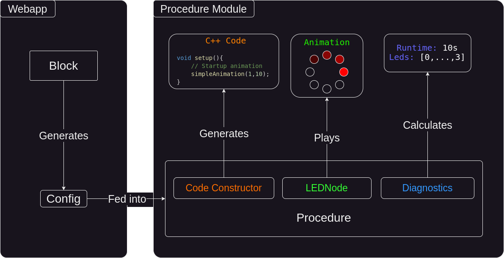

# Procedure Module

You may have noticed that blocks can perform various functions such as generating c++ code, providing diagnostic information about their runtime, accessing LEDs, and visually demonstrating the generated code through animations.

How is that possible with a simple block?

That's where procedures come in, and they function as follows:

A procedure is a collection of the following components:

- A Code Constructor: Responsible for generating the (C++) source code.
- Diagnostic Information: Details on how long the generated code will run and which LEDs are accessed during its execution.
- LEDNode: Plays the animation of the procedure and visually represents what the code will do.

Additionally, each procedure exposes a simple object used to configure its behavior.

These procedures are fully decoupled from the blocks and theoretically don't even need blocks to function. The Blockly interface simply generates configurations for these procedures, which then execute actions based on these configurations.

You can think of it like this:

The blocks (from the web app) generate configurations for the procedures, which then execute actions based on these configurations.

Several advantages can be achieved using this system:

- Responsibility is split, with each system having a specific task only. The web app doesn't need to worry about the procedures, and the procedures don't need to concern themselves with constructing configurations.
- Multiple blocks can use a single procedure, exposing different ways of configuring it.

Let's explore how procedures work in detail by implementing one ourselves in the next section.