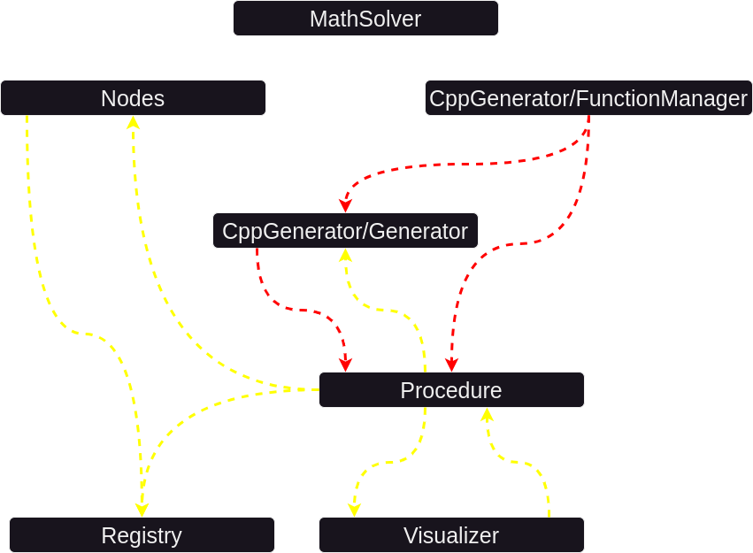

## Module System

The application is divided into different modules, each operating under the following conditions:
- Minimize contact with other modules.
- Expose important functionalities using an `index.ts` file whenever possible.

This ensures that modules act as islands, making them easily extendable.

Modules can easily be imported by using their "@" attribute.

Currently, the following modules exist:

- `CppGenerator/FunctionManager`: Responsible for generating C++ functions. (`@cppgen/functionManager`)
- `CppGenerator/Generator`: Responsible for generating C++ code from a list of procedures and their configurations. (`@cppgen/generator`)
- `MathSolver`: Responsible for resolving simple math equations with optional variables. It takes in strings and returns a single calculated number. (`@mathSolver`)

- `Nodes`: Defines the Blockly blocks and their input data. Nodes abstract away the building of actual blocks used for the UI, focusing solely on providing definitions. (`@nodes`)

- `Procedure`: Responsible for generating code, creating animations/visualizations, and providing diagnostics for itself (e.g., runtime or accessed LEDs). (`@procedure`)

- `Visualizer`: Manages the visualizations of procedures, handling playback without directly accessing the user interface. Instead, it sends updates through a callback to the UI. (`@visualizer`)

- `Registry`: Maintains registers for all known procedures and nodes. (`@registry`)

This diagram illustrates how the different modules interact with each other.

- Yellow: Module pulls from other module for definitions only
- Red: Module pulls from other module for program logic

Modules which don't import anything as called "Self contained modules".

The next sections explain how the different models work in detail.